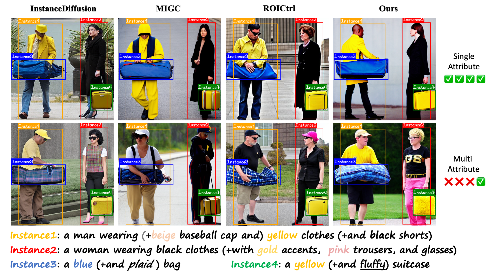
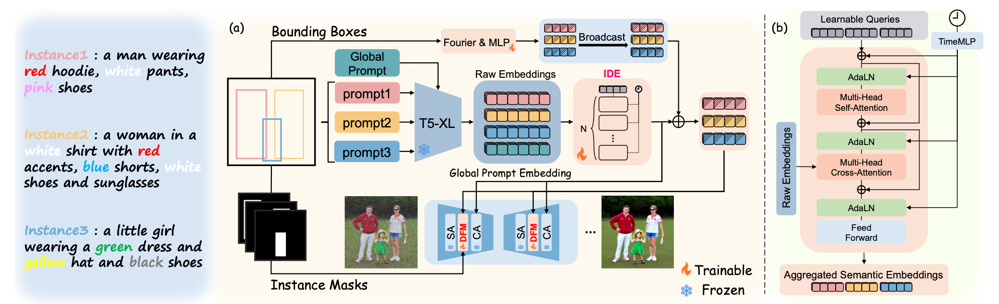

# DEIG: Detail-Enhanced Instance Generation with Fine-Grained Semantic Control

<p align="center">
  
</p>

---

## Introduction

Official implementation of **DEIG**, a framework for fine-grained multi-instance generation that enhances semantic alignment and multi-attribute control through instance-aware semantic extraction and masked attention fusion in diffusion models.

<p align="center">
  
</p>

---

## Installation

```bash
conda create -n deig python=3.10 -y
conda activate deig

cd DEIG
pip install -r requirements.txt
```


## Checkpoint Download

```bash
# Main Model
huggingface-cli download dushy5/DEIG --local-dir checkpoints/
```

Directory structure:

```
checkpoints/
├── model.pth/
└── T5-XL/
```

---

## Inference

```bash
python inference.py --fp16
```

---

## Evaluation

### Additional Packages for Evaluation

```bash
pip install -e eval/segment_anything
pip install -e eval/GroundingDINO --no-build-isolation
```

---

### Evaluation Models Download

```bash
# CLIP model
huggingface-cli download openai/clip-vit-large-patch14 --local-dir checkpoints/clip

# BERT model
huggingface-cli download google-bert/bert-base-uncased --local-dir checkpoints/bert-base-uncased

# Qwen2.5-VL
huggingface-cli download Qwen/Qwen2.5-VL-7B-Instruct --local-dir checkpoints/Qwen2.5-VL-7B-Instruct

# GroundingDINO
wget -P checkpoints/ https://github.com/IDEA-Research/GroundingDINO/releases/download/v0.1.0-alpha/groundingdino_swint_ogc.pth
```

For **MIG-Bench** evaluation, also download SAM:

```bash
# SAM model (for instance segmentation)
wget -P checkpoints/ https://dl.fbaipublicfiles.com/segment_anything/sam_vit_h_4b8939.pth
```
### DEIG-Bench

```bash
python eval/eval_deigbench.py \
    --run_eval \
    --need_clip_score \
    --need_miou_score \
    --need_attribute_stats
```

### MIG-Bench

```bash
python eval/eval_migbench.py \
    --run_eval \
    --need_clip_score \
    --need_miou_score \
    --need_instance_sucess_ratio
```
